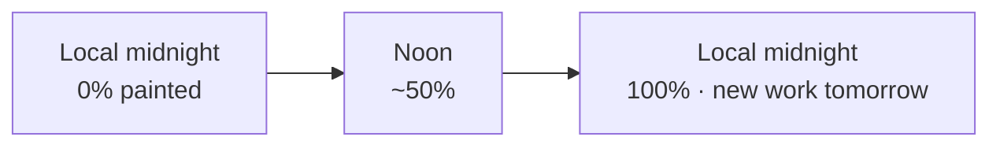

#  Veil — Daily Image Reveal

**A museum visit in your new tab** — one curated painting slowly reveals itself from local midnight to midnight, then a new work begins tomorrow.

[](https://developer.chrome.com/docs/extensions/mv3/intro/)
[](#implement--test-locally)
[](manifest.json)
[](LICENSE)

**Author:** [Sarang Birhade (@sarang7798)](https://github.com/sarang7798)

---

## Features

- **24-hour reveal** — progress is elapsed local time since midnight ÷ 24h (clock-derived; closing the tab does not reset it)
- **Met Open Access by default** — curated public-domain paintings from [The Metropolitan Museum of Art](https://www.metmuseum.org/), chosen deterministically by date; offline fallback via bundled `assets/days/`
- **Reveal styles** — paint strokes (default), mist lift, mosaic dissolve, curtain blinds
- **Gallery presentation** — warm wall, wood frame and mat, museum plaque (collection · title · artist · date), soft progress under the plaque
- **Quiet chrome** — Hide/Show for UI, settings in the new tab or full Options page
- **Progress preview** — debug slider to simulate unveil amount without waiting out the day

## Screenshots

> Add captures under `screenshots/` and link them here when ready.

```text
screenshots/
  newtab-midday.png    # painting partially revealed
  newtab-complete.png  # end-of-day unveil
  settings.png         # options / progress preview
```

<!-- Example once files exist:

-->

## How the daily reveal works



| Time of day | Approx. unveil |
| --- | --- |
| Midnight | 0% |
| Noon | ~50% |
| End of day | 100% |

Progress never depends on how long the tab stays open. At the next local midnight, a new work is selected from the active image source.

**Image sources** (Settings → Image source):

| Source | Behavior |
| --- | --- |
| The Met (Open Access) | Default curated catalog, date-seeded |
| Bundled catalog (offline) | Local images in `assets/days/` |
| Remote daily (Picsum) | Seeded Picsum URL for the day |

## Implement & test locally

### Load the extension

1. Open Chrome.
2. Go to `chrome://extensions`.
3. Turn on **Developer mode** (top right).
4. Click **Load unpacked** → select this folder (the one that contains `manifest.json`).
5. Confirm **Veil — Daily Image Reveal** appears in your extensions list.
6. After code changes: click **Reload** on the Veil card, then open a fresh new tab.

### Test the reveal

1. Open a new tab (`Ctrl+T` / `Cmd+T`). You should see the gallery — not a full reveal at the wrong time of day.
2. Real progress follows your clock over 24 hours (midnight → midnight).
3. To try stages without waiting: open **Settings** on the new tab → **Progress preview (debug)**. Turn on the override, then drag the slider (e.g. 0%, 25%, 50%, 100%).
4. Turn preview **off** to return to live day progress.
5. Optional: open the full Options page from `chrome://extensions` → **Veil** → **Details** → **Extension options**.
6. Common issues:
   - Wrong folder selected (pick the folder that contains `manifest.json`).
   - Forgot to click **Reload** after edits.
   - Check the **Errors** button on the extension card if something breaks.

## Settings

Available from the new-tab **Settings** sheet and the Options page:

| Setting | Notes |
| --- | --- |
| Show clock & plaque | Hide/show exhibit chrome (also via **Hide** / **Show**) |
| 24-hour clock / Show seconds | Clock display |
| Reveal style | Paint, mist, mosaic, or curtain |
| Image source | Met, bundled offline, or Picsum |
| Progress preview | Debug override of day progress |

## Monetization notes

Compliance-minded hooks only — nothing spammy is wired by default:

- **Veil+** — local “unlocked” preview toggle for future messaging (past-day gallery, early clarity, custom catalogs). No payment flow.
- **Partner slot** — optional single quiet footer label + URL (leave blank to hide). Disclose clearly if publishing to the Chrome Web Store.
- Prefer this over search hijacking or intrusive ads.

## Inspiration

Designed after [@airlasart](https://www.instagram.com/airlasart/)’s post [`Dac-PbaMuXr`](https://www.instagram.com/p/Dac-PbaMuXr/) — a screen experience that *“slowly reveals a real painting from the Met”* as a museum visit between meetings. Video frames were not accessible without login; the UI follows the public caption and museum/gallery conventions (framed work, plaque, paint-stroke reveal, soft gallery wall).

## Project layout

```text
manifest.json                 Extension manifest (v1.1.0, MV3)
newtab.html                   Gallery new-tab UI
options.html                  Full settings page
styles/newtab.css             Gallery styles
styles/options.css            Options styles
scripts/day.js                Local-day progress helpers
scripts/images.js             Met + local + remote catalogs
scripts/reveal.js             Paint / mist / mosaic / curtain
scripts/newtab.js             New-tab wiring
scripts/options.js            Options wiring
assets/days/                  Offline fallback images
icons/                        Extension icons
```

## Author

**Sarang Birhade** — [@sarang7798](https://github.com/sarang7798)

See [CONTRIBUTORS.md](CONTRIBUTORS.md). This project does not accept public pull-request merges; see [CONTRIBUTING.md](CONTRIBUTING.md).

## Attribution & license

**Proprietary — All Rights Reserved.** See [LICENSE](LICENSE).

The Veil extension source and design are copyright Sarang Birhade. Commercial use, redistribution, and republication require prior written permission. You may fork for personal, non-commercial experimentation only, under the LICENSE terms.

Met images used via curated Open Access URLs; respect [The Met’s Open Access policies](https://www.metmuseum.org/about-the-met/policies-and-documents/open-access) when distributing museum content.
